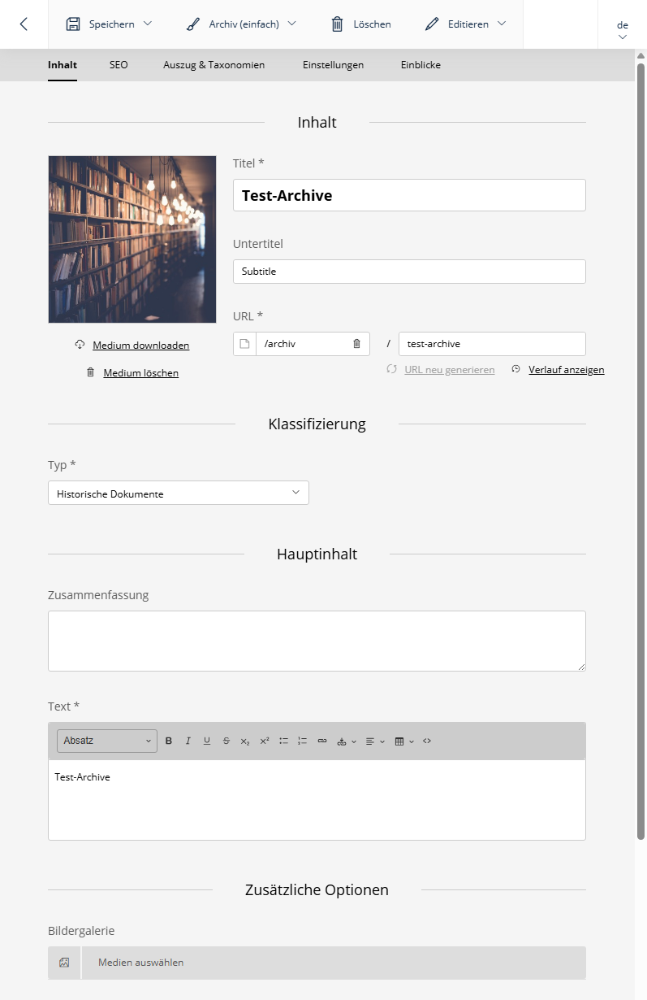

# SuluArchiveBundle!


[](https://github.com/manuxi/SuluArchiveBundle/blob/main/LICENSE)


[🇬🇧 English Version](README.md)

Das SuluArchiveBundle erweitert Sulu CMS um eine umfassende Archiv-Verwaltung.

Es ermöglicht die Erstellung und Verwaltung von Archiv-Einträgen mit detaillierten Informationen, Dokumenten, Medien-Galerien und mehrsprachiger Unterstützung.

Über 30 konfigurierbare Archiv-Typen erlauben eine flexible Kategorisierung von historischen Dokumenten, Fotos, Zeitungsartikeln und mehr.



## ✨ Features

### 📚 Archiv-Verwaltung
- **Umfangreiche Archiv-Details** - Verschiedene Templates; Titel, Untertitel, Zusammenfassung, Text, Fußnoten/Quellen
- **Dokumenten-Verwaltung** - PDF-Anhänge für herunterladbare Dokumente
- **Medien-Integration** - Hauptbilder und Bildergalerien
- **30+ Archiv-Typen** - Straßen, Gebäude, historische Dokumente, Fotos, Zeitungsartikel und mehr
- **SEO & Excerpt** - Vollständige SEO- und Excerpt-Verwaltung
- **Mehrsprachig** - Vollständige Übersetzungsunterstützung
- **Autoren-Verwaltung** - Kontakte können als Archiv-Autoren zugewiesen werden
- **Weiteres** - Papierkorb, Referenzen, Sitemaps, Teaser, usw.

### 🔄 Erweiterte Features
- **Smart Content** - Als Content-Block in jeder Sulu-Seite verwendbar
- **Teaser Provider** - Archive als Teaser verfügbar
- **Link Provider** - Einfache Verlinkung zu Archiv-Einträgen in Text-Editoren
- **Sitemap-Integration** - Automatische Sitemap-Generierung
- **Such-Integration** - Volltextsuche in Admin und Website

## 📋 Voraussetzungen

- PHP 8.2 oder höher
- Sulu CMS 3.0 oder höher
- Symfony 6.2 oder höher
- MySQL 5.7+ / MariaDB 10.2+ / PostgreSQL 11+

## 👩🏻‍🏭 Installation

### Schritt 1: Paket installieren

```bash
composer require manuxi/sulu-archive-bundle
```

Falls du *nicht* Symfony Flex verwendest, füge das Bundle in `config/bundles.php` hinzu:

```php
return [
    //...
    Manuxi\SuluArchiveBundle\SuluArchiveBundle::class => ['all' => true],
];
```

### Schritt 2: Routen konfigurieren

Zu `routes_admin.yaml` hinzufügen:

```yaml
SuluArchiveBundle:
    resource: '@SuluArchiveBundle/Resources/config/routes_admin.yaml'
```

Für die Website-Frontend, zu `routes_website.yaml` hinzufügen:

```yaml
SuluArchiveBundle:
    resource: '@SuluArchiveBundle/Resources/config/routes_website.yaml'
```

### Schritt 3: Datenbank aktualisieren

```bash
# Prüfe was erstellt wird
php bin/console doctrine:schema:update --dump-sql

# Führe Migration aus
php bin/console doctrine:schema:update --force
```

### Schritt 4: Berechtigungen erteilen

1. Gehe zu Sulu Admin → Einstellungen → Benutzerrollen
2. Finde die passende Rolle
3. Aktiviere Berechtigungen für "Archive"
4. Lade die Seite neu

## 🎣 Verwendung

### Ersten Archiv-Eintrag erstellen

1. Navigiere zu **Archiv** in der Sulu-Admin-Navigation
2. Klicke auf **Archiv hinzufügen**
3. Wähle einen Archiv-Typ
4. Fülle die Details aus (Titel, Text, Bilder, Dokumente)
5. Konfiguriere Autoren-Einstellungen (optional)
6. Veröffentliche deinen Archiv-Eintrag

## 🧶 Konfiguration

Die Konfiguration findest Du hier: [Einstellungen](docs/settings.de.md)

## 📖 Dokumentation

Detaillierte Dokumentation im [docs/](docs/) Verzeichnis.

- [Archiv-Typen](docs/archive-types.de.md) - Eigene Archiv-Typen konfigurieren
- [Sitemap](docs/sitemap.de.md) - Sitemap-Integration
- [Einstellungen](docs/settings.de.md) - Konfigurationsoptionen

## 👩‍🍳 Mitwirken

Beiträge sind willkommen! Bitte erstelle Issues oder Pull Requests.

## 📝 Lizenz

Dieses Bundle ist unter der MIT-Lizenz lizenziert. Siehe [LICENSE](LICENSE).

## 🎉 Credits

Erstellt und gewartet von [manuxi](https://github.com/manuxi).

Danke an das Sulu-Team für das tolle CMS und den fantastischen Support!

Und danke an *Dich* für Deine Mithilfe, Tests und Bugsuche!
